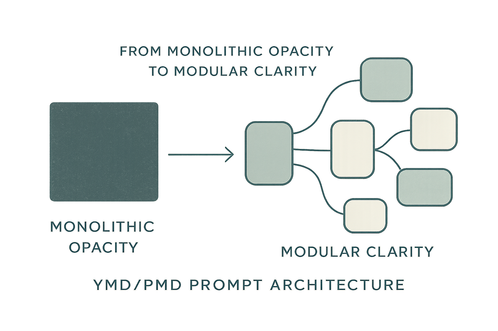

# YMD/PMD Format Specification

**Structured, Modular AI Prompts**

YMD/PMD is a format for creating maintainable, reusable AI prompts using YAML, Markdown, and Jinja2 templating.

---

## What is YMD/PMD?

### YMD (YAML + Markdown + Jinja2)
**Orchestrator files** that aggregate reusable components into complete prompts.

```yaml
meta:
  id: code_reviewer
  kind: review
  version: 1.0.0
  title: Code Review Assistant

system: |
  

user: |
  Review this code: {{ code }}
```

### PMD (Prompt Markdown + Jinja2)
**Component files** that are pure Markdown + Jinja2, reusable across prompts.

```markdown
You are an expert in {{ domain }}.

Your approach:
- Clear, actionable feedback
- Best practices focus
```

---

## Key Features

### Modular Design
- **YMD files** orchestrate complete prompts
- **PMD files** are reusable building blocks
- Compose complex prompts from simple parts

### Fully Customizable
- Sections are **not limited** to standard names
- Use any YAML key that makes sense
- Domain-specific organization supported

### Recursive Composition
- PMDs can include other PMDs
- Build hierarchies of components
- Unlimited nesting (with best practices)

### Single Source of Truth
- Define components once
- Reuse across multiple prompts
- Maintain consistency easily

---

## Quick Example

### Complete Prompt (YMD)
```yaml
meta:
  id: api_design_assistant
  kind: api_design
  version: 1.0.0
  title: API Design Assistant

system: |
  

api_principles: |
  

security_requirements: |
  

user: |
  Design API for: {{ requirement }}
```

### Component (PMD)
```markdown
You are an API architect specializing in {{ api_style }} APIs.

Your expertise:
- RESTful design patterns
- API versioning strategies
- Performance optimization
- Security best practices
```

---

## Why YMD/PMD?

### Before: Monolithic Prompts
```yaml
# Hard to maintain
# Difficult to reuse
# Duplication everywhere
system: |
  You are an expert...
  [100+ lines of mixed content]
```

### After: Modular Components
```yaml
# Clean structure
# Reusable parts
# Easy to maintain
system: |
  

review_focus: |
  
  
```

---

## Getting Started

### 1. Install
```bash
git clone https://github.com/daviguides/ymd-spec.git
cd ymd-spec
./install.sh
```

### 2. Load Context (in Claude Code)
```
/load-ymd-context
```

### 3. Create Your First Prompt
```
/create-ymd-manifest
```

Or use the interactive agent:
```
@ymd-author
```

---

## Documentation

- **[Format Specifications]()** - Complete YMD/PMD format reference
- **[Quick Start Guide]()** - Get started in 5 minutes
- **[Examples]()** - Real-world usage examples
- **[Best Practices]()** - Guidelines and patterns
- **[Cheatsheet]()** - Quick reference

---

## Use Cases

### Code Review
```yaml
system: |
  

review_focus: |
  
  
```

### API Design
```yaml
system: |
  

api_principles: |
  
```

### Documentation
```yaml
system: |
  

style_guide: |
  
```

---

## Tools & Integration

### Claude Code Plugin
```bash
# Commands
/load-ymd-context          # Load format knowledge
/create-ymd-manifest       # Create YMD file
/create-pmd-partial        # Create PMD component
/validate-composition      # Validate structure

# Agents
@ymd-author               # Interactive authoring
@composition-expert       # Structure optimization
@ymd-validator           # Validation & debugging
```

### Python Library
```python
from ymd_prompt import render_ymd

result = render_ymd(
    "prompts/code_review.ymd",
    variables={"language": "python", "code": code_sample}
)
```

### VSCode Extension
- Syntax highlighting for `.ymd` and `.pmd` files
- Auto-completion for includes
- Validation on save

---

## Community

- **GitHub**: [daviguides/ymd-spec](https://github.com/daviguides/ymd-spec)
- **Issues**: [Report bugs or request features](https://github.com/daviguides/ymd-spec/issues)
- **Discussions**: [Ask questions, share prompts](https://github.com/daviguides/ymd-spec/discussions)

---

## Related Projects

- **[ymd-prompt](https://github.com/daviguides/ymd-prompt)** - Python library for rendering YMD files
- **[vscode-ymd](https://github.com/daviguides/vscode-ymd)** - VSCode syntax highlighting extension

---

## License

MIT License - see [LICENSE](https://github.com/daviguides/ymd-spec/blob/main/LICENSE) for details.
